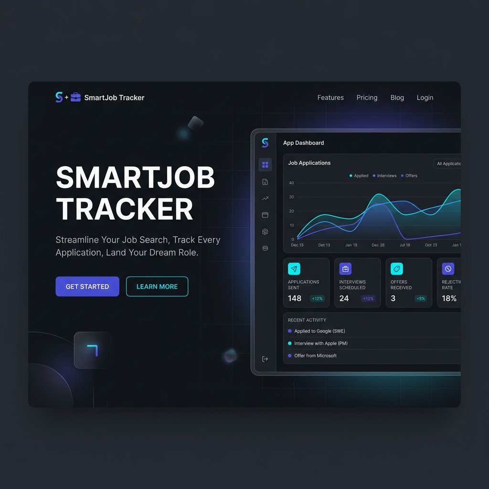

# 🚀 SmartJob Tracker

[](https://vitejs.dev/)
[](https://reactjs.org/)
[](https://firebase.google.com/)
[](https://opensource.org/licenses/MIT)

**SmartJob Tracker** is a premium, high-performance job application tracking system designed for modern job seekers. Built with React and Firebase, it combines elegant aesthetics with powerful analytics to help you land your dream role.



## ✨ Key Features

- **📊 Dynamic Analytics**: Visualize your progress with intuitive charts (Recharts) and real-time statistics.
- **💼 Application Management**: Create, update, and manage your job applications with a streamlined interface.
- **⚡ Real-time Sync**: Powered by Firebase Firestore for instantaneous data updates across devices.
- **🎭 Motion UI**: Fluid transitions and micro-animations using Framer Motion for a premium feel.
- **📱 Fully Responsive**: Optimized for both desktop and mobile workflows.
- **🔔 Interactive Notifications**: Real-time feedback via React-Toastify.

## 🛠️ Tech Stack

- **Frontend**: Vite, React 18, React Router 6
- **Styling**: Vanilla CSS (Custom System), React Icons, Lucide React
- **Backend / Database**: Firebase (Firestore, Auth)
- **Visualization**: Recharts
- **Forms**: React Hook Form, Yup
- **Animations**: Framer Motion

## 🚀 Getting Started

### Prerequisites

- [Node.js](https://nodejs.org/) (v18 or higher)
- [npm](https://www.npmjs.com/) or [yarn](https://yarnpkg.com/)

### Installation

1. **Clone the repository**
   ```bash
   git clone https://github.com/your-username/smart-job-tracker.git
   cd smart-job-tracker
   ```

2. **Install dependencies**
   ```bash
   npm install
   ```

3. **Configure Firebase**
   Create a `.env` file in the root directory and add your Firebase configuration:
   ```env
   VITE_FIREBASE_API_KEY=your_api_key
   VITE_FIREBASE_AUTH_DOMAIN=your_auth_domain
   VITE_FIREBASE_PROJECT_ID=your_project_id
   VITE_FIREBASE_STORAGE_BUCKET=your_storage_bucket
   VITE_FIREBASE_MESSAGING_SENDER_ID=your_sender_id
   VITE_FIREBASE_APP_ID=your_app_id
   ```

4. **Run development server**
   ```bash
   npm run dev
   ```

## 📂 Project Structure

```bash
src/
├── components/   # Reusable UI components (Layout, Sidebar, etc.)
├── context/      # State management (AuthContext, etc.)
├── hooks/        # Custom React hooks
├── pages/        # Main application views (Dashboard, Analytics)
├── services/     # Firebase and external API logic
├── utils/        # Helper functions
└── App.jsx       # Main application routing
```

## 📜 License

Distributed under the MIT License. See `LICENSE` for more information.

---

<p align="center">
  Built with ❤️ by Your Name
</p>
